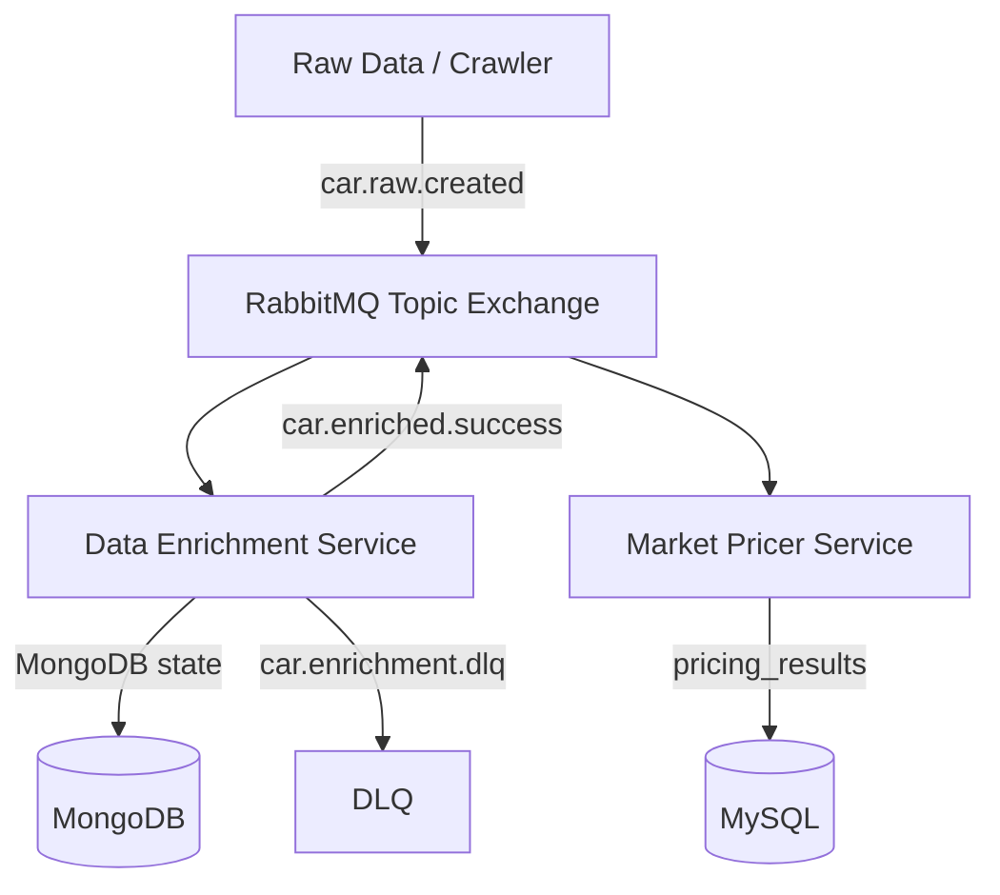

# AutoPulse

Smart Vehicle Auction Aggregator & Pricer — microservice scaffold for dealers
and flippers. Raw listings are enriched (LLM + CV), then priced with a margin
rule engine.

## Architecture



| Service | Port | Responsibility |
|---------|------|----------------|
| `enrichment` | 8001 | LLM + CV enrichment, Mongo state, ack-on-aggregation |
| `pricer` | 8002 | Margin rules, turnover estimate, MySQL persistence |
| RabbitMQ | 5672 / 15672 | Topic exchange `autopulse.cars` |
| MongoDB | 27017 | Per-car enrichment state |
| MySQL | 3306 | Structured pricing metrics |

## Quick start

```bash
cp .env.example .env
docker compose up -d --build
```

- Enrichment health: http://localhost:8001/health
- Pricer health: http://localhost:8002/health
- RabbitMQ UI: http://localhost:15672 (`autopulse` / `autopulse`)

Local (without Docker services images):

```bash
make install
# start infra only: docker compose up -d rabbitmq mongodb mysql
uvicorn services.enrichment.app.main:app --reload --port 8001
uvicorn services.pricer.app.main:app --reload --port 8002
```

## Routing keys

| Key | Purpose |
|-----|---------|
| `car.raw.created` | Raw listing ingested |
| `car.enriched.success` | LLM + CV aggregation complete |
| `car.enrichment.failed` | Soft failure event |
| `car.enrichment.dlq` | Dead-letter after N retries |

## Repo layout

```
services/enrichment/   FastAPI + aio_pika + Motor + LLM/CV
services/pricer/       FastAPI + aio_pika + SQLAlchemy/MySQL
shared/                Pydantic event & domain contracts
docs/                  Architecture, roadmap, ADRs, agent briefs
.cursor/rules/         Persistent agent rules
```

## Status

This is a **scaffold**. Consumers, Mongo/MySQL persistence, LLM, and CV are
stubbed with `TODO(week-N)` markers. See [docs/roadmap.md](docs/roadmap.md).

## Dev commands

```bash
make test
make lint
make format
```
