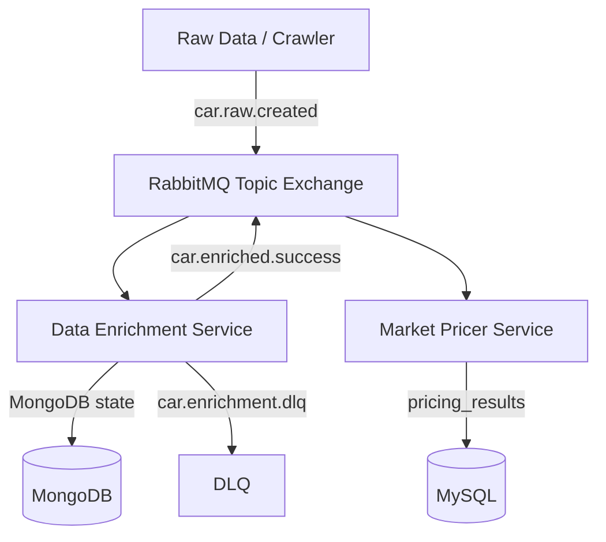

# AutoPulse

Smart Vehicle Auction Aggregator & Pricer — microservice scaffold for dealers
and flippers. Raw listings are enriched (LLM + CV), then priced with a margin
rule engine.

## Architecture



| Service | Port | Responsibility |
|---------|------|----------------|
| `enrichment` | 8001 | LLM + CV enrichment, Mongo state, ack-on-aggregation |
| `pricer` | 8002 | Margin rules, turnover estimate, MySQL persistence |
| RabbitMQ | 5672 / 15672 | Topic exchange `autopulse.cars` |
| MongoDB | 27017 | Per-car enrichment state |
| MySQL | 3306 | Structured pricing metrics |

## Quick start (local)

```bash
cp .env.example .env
docker compose up -d --build
```

Uses `compose.yaml` + `compose.override.yaml` (host ports, bind mounts, reload).

- Enrichment health: http://localhost:8001/health
- Pricer health: http://localhost:8002/health
- RabbitMQ UI: http://localhost:15672 (`autopulse` / `autopulse`)

Optional logs stack: `make up-observability` — see [docs/logging.md](docs/logging.md).

Production overlay (registry images, no DB ports): see [docs/docker.md](docs/docker.md).
RabbitMQ production checklist: [docs/messaging.md](docs/messaging.md).

```bash
export TAG=$(git rev-parse --short HEAD)
make config-prod   # validates with dummy secrets
# deploy: set ENRICHMENT_ENV_FILE, PRICER_ENV_FILE, RABBITMQ_*, MYSQL_*
# then: make up-prod TAG=$TAG ...
```

Local infra ports bind to `127.0.0.1` only (see `compose.override.yaml`).

Local (Poetry, without Docker app images):

```bash
python scripts/poetry_install.py   # or: make install
docker compose up -d rabbitmq mongodb mysql
poetry run uvicorn services.enrichment.app.main:app --reload --port 8001
poetry run uvicorn services.pricer.app.main:app --reload --port 8002
```

See [docs/poetry.md](docs/poetry.md) for monorepo dependency isolation.

## Routing keys

| Key | Purpose |
|-----|---------|
| `car.raw.created` | Raw listing ingested |
| `car.enriched.success` | LLM + CV aggregation complete |
| `car.enrichment.failed` | Soft failure event |
| `car.enrichment.dlq` | Dead-letter after N retries |

## Repo layout

```
services/enrichment/   FastAPI + aio_pika + Motor + LLM/CV
services/pricer/       FastAPI + aio_pika + SQLAlchemy/MySQL
shared/                Pydantic event & domain contracts
docs/                  Architecture, roadmap, ADRs, agent briefs, docker
compose.yaml           Base stack (pinned images, healthchecks, networks)
compose.override.yaml  Local ports / bind mounts / reload
compose.prod.yaml      Registry images by TAG; no DB host ports
.cursor/rules/         Persistent agent rules
```

## Status

Week-1 enrichment pipeline is implemented. Pricer Rabbit/MySQL wiring is next
(week 2). Docker layout follows the production checklist — see
[docs/docker.md](docs/docker.md) and [docs/roadmap.md](docs/roadmap.md).

## Dev commands

```bash
make test
make lint
make format   # ruff format shared services
```
