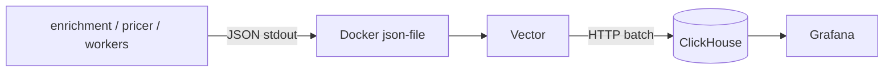

# Logging (structlog → Vector → ClickHouse → Grafana)



Apps emit JSON logs to stdout (Factor XI). Vector tails Docker logs for
containers labeled `com.autopulse.logs=true`, remaps fields, and batches
inserts into ClickHouse. Grafana explores via the ClickHouse datasource.

## Enable locally

Observability services use Compose profile `observability` (off by default):

```bash
docker compose --profile observability up -d --build
# or: make up-observability
```

| Endpoint | URL |
|----------|-----|
| ClickHouse HTTP | http://127.0.0.1:8123 |
| Grafana | http://127.0.0.1:3000 (`admin` / `admin` by default) |

## Python side

Shared setup: `autopulse_shared.logging.setup_logging`. Both services wrap it
and pass `service` + `ENVIRONMENT`. Stdlib `logging.getLogger` keeps working
through a ProcessorFormatter bridge.

`RequestIdMiddleware` and Rabbit consumers bind `trace_id` (and optional
`event_id` / `external_id`) via structlog contextvars.

## Vector / Docker socket

Vector mounts `/var/run/docker.sock` read-only to scrape container stdout.
Treat that host as trusted: anyone with the socket can inspect all containers
on the daemon. Prefer a dedicated logging host/agent in hardened prod setups.

## Sample ClickHouse queries

```sql
-- One request / message correlation
SELECT timestamp, level, event, attributes
FROM logs.python_app_logs
WHERE trace_id = '…'
ORDER BY timestamp ASC;

-- Recent errors for a service
SELECT timestamp, event, raw
FROM logs.python_app_logs
WHERE service = 'enrichment' AND level = 'error'
ORDER BY timestamp DESC
LIMIT 50;

-- Error volume last hour
SELECT event, count(*) AS err_count
FROM logs.python_app_logs
WHERE level = 'error' AND timestamp >= now() - INTERVAL 1 HOUR
GROUP BY event
ORDER BY err_count DESC;
```

## Production

Set `COMPOSE_PROFILES=observability` (or pass `--profile observability`) and
provide fail-closed secrets: `CLICKHOUSE_USER`, `CLICKHOUSE_PASSWORD`,
`GRAFANA_ADMIN_USER`, `GRAFANA_ADMIN_PASSWORD`. No host ports are published
for ClickHouse/Grafana in the prod overlay.
